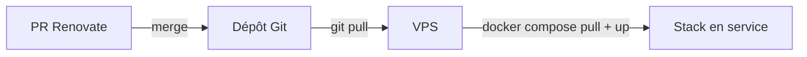

<figure markdown="span">
  
</figure>

**Dockarr** déploie, configure, pilote et maintient à jour une stack média
**\*arr** complète, auto-hébergée, avec Docker Compose.

## La stack

| Service | Rôle | Port |
| --- | --- | --- |
| [qBittorrent](https://www.qbittorrent.org/) | Client torrent | 8080 |
| [QUI](https://github.com/autobrr/qui) | Interface web moderne pour qBittorrent | 7476 |
| [Prowlarr](https://wiki.servarr.com/prowlarr) | Gestionnaire d'indexeurs | 9696 |
| [Radarr](https://wiki.servarr.com/radarr) | Films | 7878 |
| [Sonarr](https://wiki.servarr.com/sonarr) | Séries | 8989 |
| [Profilarr](https://github.com/Dictionarry-Hub/profilarr) | Sync des profils de qualité & custom formats | 6868 |
| [Seerr](https://github.com/seerr-team/seerr) | Demandes & découverte de contenu | 5055 |
| [Jellyfin](https://jellyfin.org/) | Serveur multimédia (vidéo) | 8096 |
| [Kavita](https://www.kavitareader.com/) | Serveur multimédia (livres / BD / mangas) | 5000 |

Un reverse proxy [Caddy](https://caddyserver.com/) place chaque service
derrière du HTTPS automatique sous `<service>.votredomaine`.

## Fonctionnement

Le **dépôt Git est la source de vérité**. Les versions des images sont
épinglées dans `docker-compose.yml`. [Renovate](updates.md) ouvre une pull
request dès qu'une nouvelle version est disponible. Vous validez et fusionnez
ce que vous voulez, et le VPS récupère le changement avec un simple
`make update`.

## Étapes suivantes

- [Installation](installation.md) : démarrer la stack
- [Configuration](configuration.md) : relier les services entre eux
- [Mises à jour](updates.md) : le workflow de mise à jour GitOps
- [VPN](vpn.md) : faire passer qBittorrent par Gluetun
