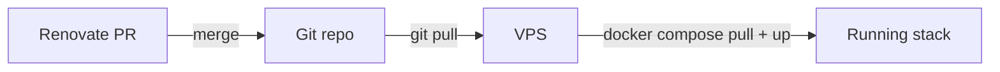

<figure markdown="span">
  
</figure>

**Dockarr** deploys, configures, pilots and keeps up to date a complete
self-hosted **\*arr** media stack with Docker Compose.

## Stack

| Service | Role | Port |
| --- | --- | --- |
| [qBittorrent](https://www.qbittorrent.org/) | Torrent client | 8080 |
| [QUI](https://github.com/autobrr/qui) | Modern web UI for qBittorrent | 7476 |
| [Prowlarr](https://wiki.servarr.com/prowlarr) | Indexer manager | 9696 |
| [Radarr](https://wiki.servarr.com/radarr) | Movies | 7878 |
| [Sonarr](https://wiki.servarr.com/sonarr) | TV shows | 8989 |
| [Profilarr](https://github.com/Dictionarry-Hub/profilarr) | Quality profiles & custom formats sync | 6868 |
| [Seerr](https://github.com/seerr-team/seerr) | Media requests & discovery | 5055 |
| [Jellyfin](https://jellyfin.org/) | Media server (video) | 8096 |
| [Kavita](https://www.kavitareader.com/) | Media server (books / comics / manga) | 5000 |

A [Caddy](https://caddyserver.com/) reverse proxy fronts every service with
automatic HTTPS under `<service>.yourdomain`.

## How it works

The **Git repository is the source of truth**. Image versions are pinned in
`docker-compose.yml`. [Renovate](updates.md) opens a pull request whenever a
new version is available. You review and merge what you want, and the VPS
pulls the change with a single `make update`.

## Next steps

- [Installation](installation.md): get the stack running
- [Configuration](configuration.md): wire the services together
- [Updates](updates.md): the GitOps update workflow
- [VPN](vpn.md): route qBittorrent through Gluetun
